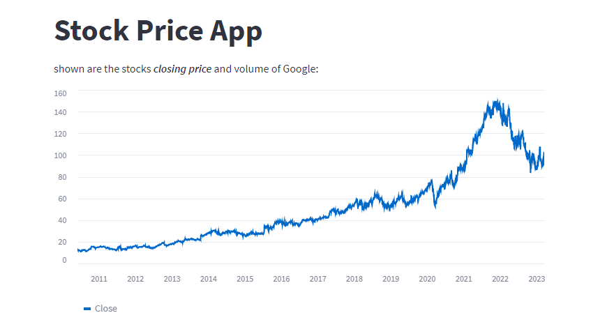
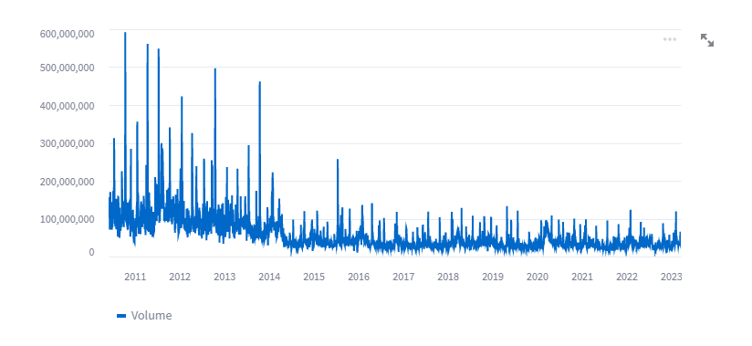
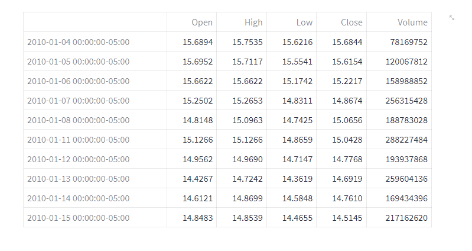

# Stock_price_web_app_with_streamlit
## Description
A simple web application demonstrating the price(closing price and volume) of google stocks over the last 10 years

## Libraries
* yfinance: a Python library that allows you to download financial data from Yahoo Finance.
* streamlit: a Python library that allows you to create interactive data-driven  web applications.
* datetime: a Python module that provides classes for working with dates and times.

## Images of the website:

